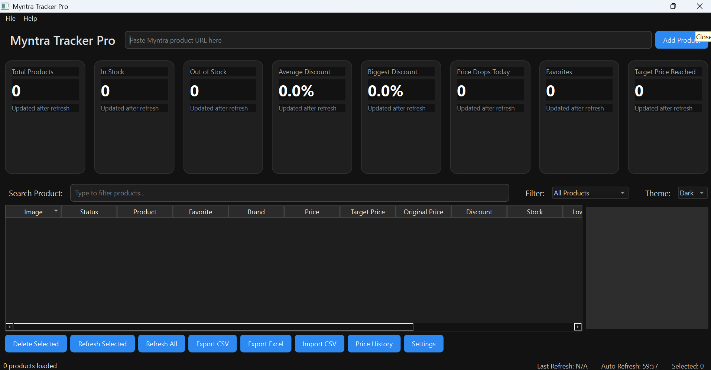
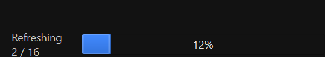
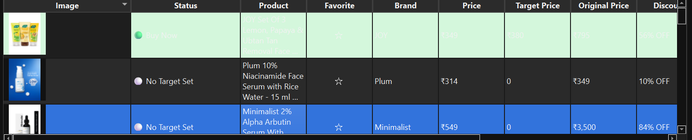
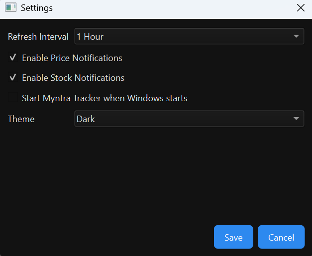
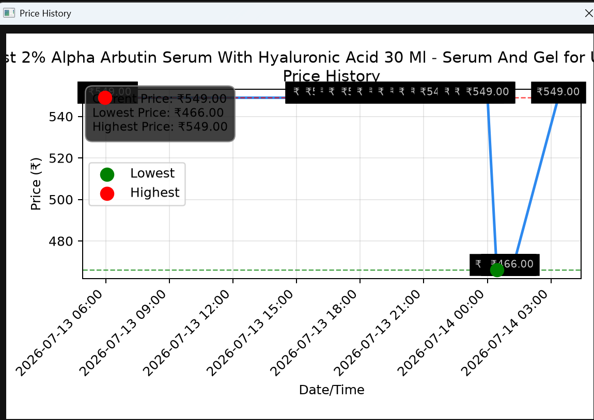

# 🛍️ Myntra Tracker Pro

Myntra Tracker Pro is a Windows desktop application that helps you track Myntra product prices, stock availability, discounts, and target prices.

## ✨ Features

- ✅ Track unlimited Myntra products
- ✅ Refresh All / Refresh Selected
- ✅ Browser reuse for faster refresh
- ✅ Auto Refresh
- ✅ Target Price Alerts
- ✅ Buy Now status
- ✅ Lowest Price Tracking
- ✅ Price History
- ✅ CSV Import / Export
- ✅ Excel Export
- ✅ Progress Bar
- ✅ Refresh Summary
- ✅ Favorites
- ✅ Light & Dark Theme

## 📦 Installation

1. Go to the Releases page.
2. Download the latest **MyntraTrackerPro.exe**.
3. Run the application.
4. The application automatically creates:
   - `data/`
   - `logs/`

No installation is required.

## 🚀 How to Use

1. Paste a Myntra product URL.
2. Click **Add Product**.
3. Set a Target Price (optional).
4. Click **Refresh All**.
5. Track price drops and stock changes.

## 📊 Main Features

- Price Monitoring
- Stock Monitoring
- Lowest Price Tracking
- Target Price Alerts
- Buy Now Indicator
- Auto Refresh
- CSV / Excel Export

## 💻 Requirements

- Windows 10 or Windows 11

## 📜 License

This project is for educational and personal use.

## 👨‍💻 Developer

NK Nk

## 📸 Screenshots

### Dashboard

### Refresh Progress

### Buy Now Status

### Settings

### Price History

